# NGSIEM Query Validation Flow

This document details the validation process for NGSIEM queries as implemented in `ngsiem_query_validator.py`.

## Validation Logic Flow

The validation process performs a series of static analysis checks on the query string. No external API calls are made during this process to ensure security and performance.

```mermaid
graph TD
    Start([Start Validation]) --> InputCheck{"Is Query<br/>Empty?"}
    
    InputCheck -- Yes --> ErrorEmpty["Return ERROR:<br/>Query cannot be empty"]
    InputCheck -- No --> Trim[Trim Whitespace]
    
    Trim --> DangerCheck[Check Dangerous Patterns]
    note1["Checks for:<br/>- SQL Injection like '; drop'<br/>- XSS patterns '<script'<br/>- Template Injection '{{}}'<br/>- Shell Injection '${}'"]
    DangerCheck -.- note1
    
    DangerCheck --> StructCheck[Structure Checks]
    
    subgraph Structure Validation
        StructCheck --> Parens{"Balanced<br/>Parentheses?"}
        Parens -- No --> IssueParens["Add Issue:<br/>Unmatched/Unbalanced ("]
        Parens -- Yes --> Brackets{"Balanced<br/>Brackets?"}
        
        IssueParens --> Brackets
        
        Brackets -- No --> IssueBrackets["Add Issue:<br/>Unmatched/Unbalanced ["]
        Brackets -- Yes --> Quotes{"Balanced<br/>Quotes?"}
        
        IssueBrackets --> Quotes
        
        Quotes -- No --> IssueQuotes["Add Issue:<br/>Unbalanced Quotes or '"]
        Quotes -- Yes --> Functions[Check Functions]
        
        IssueQuotes --> Functions
    end
    
    Functions --> FuncCheck{"Known<br/>Function?"}
    note2["Verifies against allowed list:<br/>count, sum, avg, kvParse, etc."]
    FuncCheck -.- note2
    
    FuncCheck -- No --> IssueFunc["Add WARNING:<br/>Unknown Function"]
    FuncCheck -- Yes --> PipeCheck[Check Pipe Syntax]
    IssueFunc --> PipeCheck
    
    PipeCheck --> PipeLogic{"Pipe<br/>Issues?"}
    note3["Checks:<br/>- Empty segments '||'<br/>- Trailing pipe '|'<br/>- Leading pipe '|...'"]
    PipeLogic -.- note3
    
    PipeLogic -- Yes --> IssuePipe["Add ERROR/WARNING:<br/>Pipe Syntax Issue"]
    PipeLogic -- No --> Mistakes[Check Common Mistakes]
    IssuePipe --> Mistakes
    
    Mistakes --> MistakeLogic{"Found<br/>Mistakes?"}
    note4["Checks:<br/>- '==' instead of '='<br/>- 'and/or' instead of 'AND/OR'<br/>- Unquoted values with spaces"]
    MistakeLogic -.- note4
    
    MistakeLogic -- Yes --> IssueMistake["Add WARNING:<br/>Common Mistake Suggestion"]
    MistakeLogic -- No --> Verdict{"Has Errors?"}
    IssueMistake --> Verdict
    
    Verdict -- Yes --> Invalid["Result: INVALID"]
    Verdict -- No --> StrictCheck{"Strict Mode?"}
    
    StrictCheck -- Yes --> WarnCheck{"Has Warnings?"}
    WarnCheck -- Yes --> Invalid
    WarnCheck -- No --> Valid
    
    StrictCheck -- No --> Valid["Result: VALID"]
    
    Valid --> Sanitize[Sanitize Query]
    note5["Sanitization:<br/>- Normalize whitespace<br/>- Remove comments"]
    Sanitize -.- note5
    
    Invalid --> ReturnResult([Return ValidationResult])
    Sanitize --> ReturnResult
```

## Detailed Function Descriptions

### 1. `check_dangerous_patterns(query)`

**Purpose**: Prevents injection attacks and execution of malicious code.

**Checks**:

- **SQL-like commands**: Detects patterns like `; drop`, `; delete`, etc., to prevent SQL injection if the query is translated to SQL.
- **XSS Vectors**: Blocks `<script` tags.
- **Template Injection**: Blocks `{{...}}` patterns.
- **Shell Injection**: Blocks `${...}` patterns.

**Severity**: `ERROR` (Stops execution).

### 2. `check_balanced_parens(query)`

**Purpose**: Ensures logical grouping and function calls are syntactically correct.

**Logic**:

- Iterates through string, tracking depth of `(` and `)`.
- Ignores parentheses inside strings (`"..."` or `'...'`).
- Detects if depth goes negative (unmatched closing) or ends non-zero (unclosed).

**Severity**: `ERROR`.

### 3. `check_balanced_brackets(query)`

**Purpose**: Ensures array definitions and field inclusions are correct.

**Logic**: Similar to parenthesis checking but for `[` and `]`.

**Severity**: `ERROR`.

### 4. `check_balanced_quotes(query)`

**Purpose**: Ensures string literals are properly closed.

**Logic**:

- Checks count of double `"` and single `'` quotes.
- Checks if counts are even.
- Handles escaped quotes (`\"`).

**Severity**: `ERROR`.

### 5. `check_function_names(query)`

**Purpose**: Validates that function calls match the supported query language catalog.

**Logic**:

- Uses regex `(\w+(?::\w+)?)\s*\(` to find function calls.
- Compares against `KNOWN_FUNCTION_PREFIXES` (e.g., `count`, `parseJson`, `ioc:lookup`).
- Heuristic: Distinguishes between function calls and field filters (e.g., `status=(...)`).

**Severity**: `WARNING` (Suggestion to fix typo).

### 6. `check_pipe_syntax(query)`

**Purpose**: Validates the structure of the pipeline.

**Checks**:

- **Empty Segments**: `||` (ERROR).
- **Trailing Pipe**: `query |` (ERROR).
- **Leading Pipe**: `| query` (WARNING - usually discouraged).

**Severity**: Mixed (`ERROR` for broken syntax, `WARNING` for style).

### 7. `check_common_mistakes(query)`

**Purpose**: Catch common user errors and suggest fixes.

**Checks**:

- **Equality**: Suggests replacing `==` with `=`.
- **Case**: Suggests uppercasing `AND/OR`.
- **Quoting**: Warns if a value with spaces is not quoted (e.g., `field=value with space` -> `field="value with space"`).

**Severity**: `WARNING`.

### 8. `sanitize_query(query)`

**Purpose**: Prepares a valid query for execution.

**Actions**:

- Normalizes whitespace (collapses multiple spaces).
- Removes single-line (`//`) and multi-line (`/* */`) comments.

**Output**: Clean query string.
