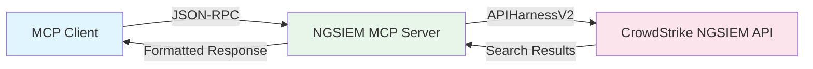
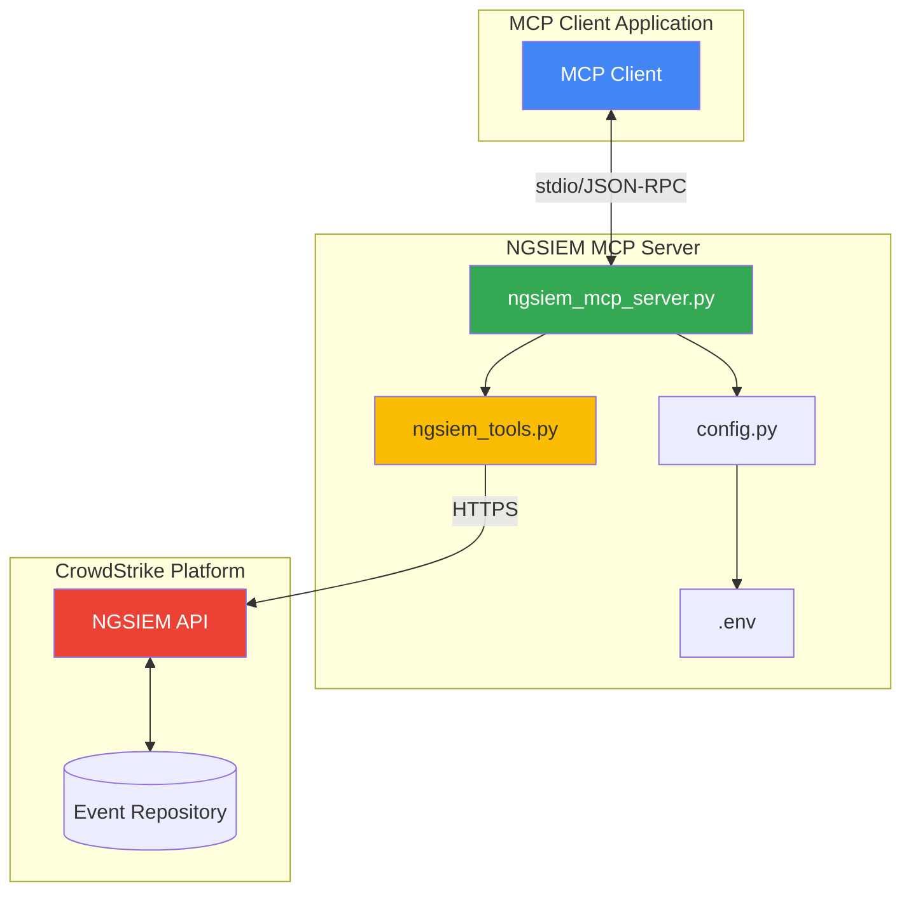
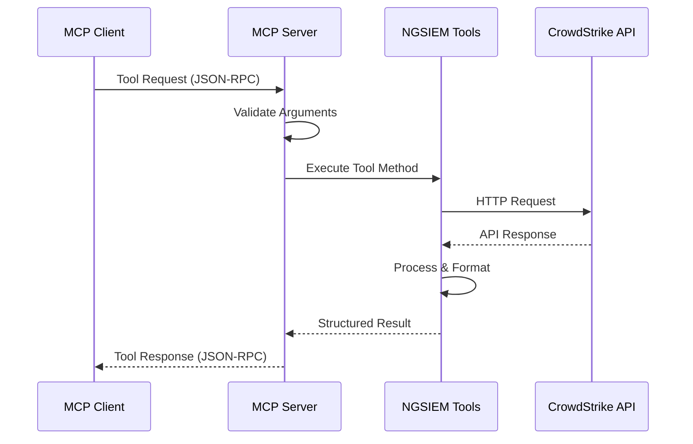
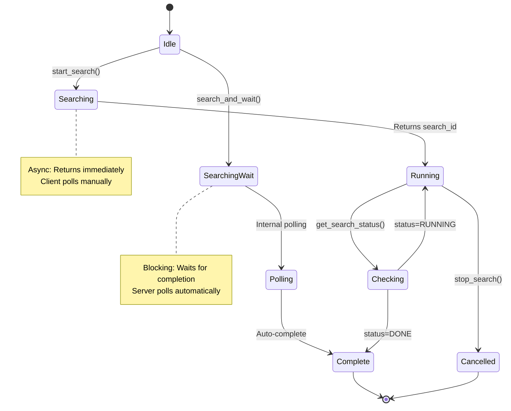
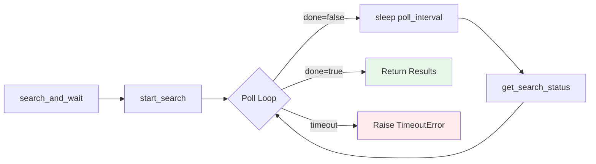
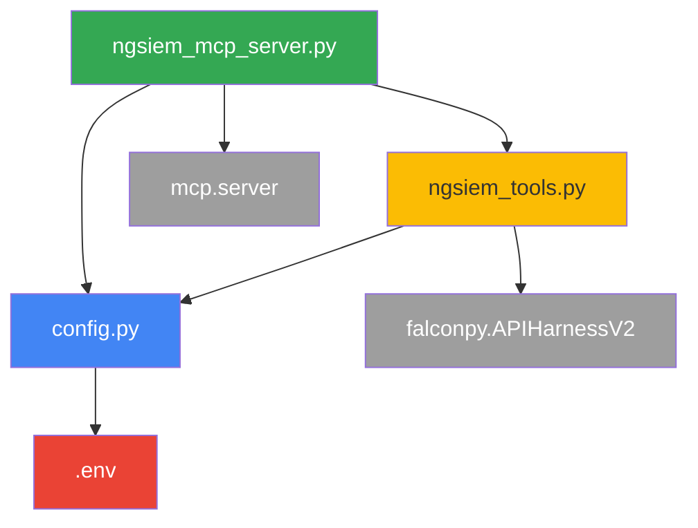
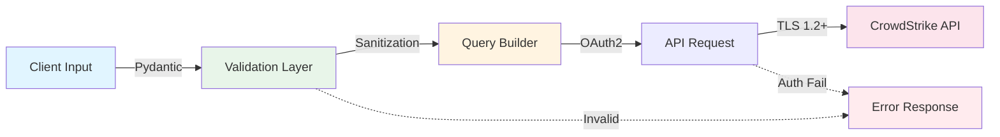
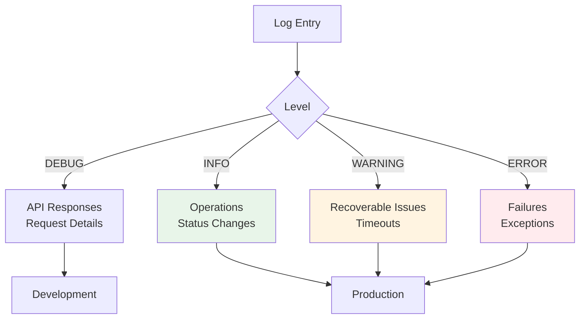

# NGSIEM MCP Server

A Model Context Protocol (MCP) server that provides programmatic access to CrowdStrike NGSIEM search capabilities. This server enables MCP-compatible applications to execute security event searches through a standardized interface.

## 🎯 Overview

This MCP server exposes CrowdStrike NGSIEM functionality through four tools, allowing any MCP client to perform threat hunting and security investigations programmatically.



## 🏗️ Architecture

### System Components



### Request Flow



## 🚀 Quick Start

### Prerequisites

- Python 3.13+
- CrowdStrike API credentials with NGSIEM scope
- MCP-compatible client application

### Installation

1. **Clone and setup environment**:
```bash
cd /path/to/cs-ngsiem-mcp
python3 -m venv .venv
source .venv/bin/activate  # On Windows: .venv\Scripts\activate
pip install -r requirements.txt
```

2. **Configure credentials**:
```bash
cp .env.example .env
nano .env
```

Required environment variables:
```env
CROWDSTRIKE_CLIENT_ID=your_client_id_here
CROWDSTRIKE_CLIENT_SECRET=your_client_secret_here
CROWDSTRIKE_BASE_URL=https://api.eu-1.crowdstrike.com
NGSIEM_DEFAULT_REPOSITORY=base_sensor
```

3. **Configure MCP client**:

The server communicates via stdio. Configure your MCP client to execute:
```bash
cd /path/to/cs-ngsiem-mcp && source .venv/bin/activate && python ngsiem_mcp_server.py
```

## 🛠️ Available Tools

### Tool Workflow



### 1. start_search

Initiates an asynchronous NGSIEM search.

**Parameters**:
- `repository` (string, optional): Repository name (defaults to `.env` config)
- `query_string` (string, required): NGSIEM query syntax
- `start` (string, optional): Time range (default: "1d")
- `is_live` (boolean, optional): Live search mode (default: false)

**Returns**: Search job ID for status polling

**Use Case**: Long-running searches where client wants progress control

**Example Query**:
```
#event_simpleName=ProcessRollup2 | FileName=powershell.exe
```

### 2. get_search_status

Retrieves status and results of a running search.

**Parameters**:
- `repository` (string, optional): Repository name
- `search_id` (string, required): ID from start_search

**Returns**: Status, event count, and results (if complete)

**Use Case**: Polling for search completion

### 3. search_and_wait

Executes search and waits for completion (blocking operation).

**Parameters**:
- `repository` (string, optional): Repository name
- `query_string` (string, required): NGSIEM query
- `start` (string, optional): Time range (default: "1d")
- `is_live` (boolean, optional): Live search mode (default: false)
- `max_wait_seconds` (integer, optional): Timeout (default: 300, max: 3600)
- `poll_interval` (integer, optional): Poll frequency (default: 2s)

**Returns**: Complete results or timeout error

**Use Case**: Quick searches with immediate results needed

**Internal Flow**:


### 4. stop_search

Cancels a running search.

**Parameters**:
- `repository` (string, optional): Repository name
- `search_id` (string, required): ID to cancel

**Returns**: Cancellation confirmation

**Use Case**: Terminating long-running searches

## 📁 Project Structure

```
cs-ngsiem-mcp/
├── ngsiem_mcp_server.py    # MCP server implementation
├── ngsiem_tools.py          # NGSIEM API wrapper
├── config.py                # Configuration management
├── .env                     # Credentials (gitignored)
├── .env.example             # Configuration template
├── requirements.txt         # Python dependencies
├── test_api.py             # Test: initiate search
├── check_search.py         # Test: retrieve results
└── README.md               # This file
```

### Module Dependencies



## 🔒 Security Architecture



### Security Features

- ✅ **No hardcoded credentials**: All secrets in `.env`
- ✅ **Input validation**: Pydantic models with strict typing
- ✅ **Query sanitization**: Prevents injection attacks
- ✅ **OAuth2 authentication**: Automatic token management
- ✅ **Audit logging**: Detailed operation logs
- ✅ **Error handling**: No sensitive data in error messages

## 🔧 Configuration

### Environment Variables

| Variable | Description | Example | Required |
|----------|-------------|---------|----------|
| `CROWDSTRIKE_CLIENT_ID` | API Client ID | `abc123...` | Yes |
| `CROWDSTRIKE_CLIENT_SECRET` | API Secret | `xyz789...` | Yes |
| `CROWDSTRIKE_BASE_URL` | API Endpoint | `https://api.eu-1.crowdstrike.com` | Yes |
| `NGSIEM_DEFAULT_REPOSITORY` | Default Repository | `base_sensor` | Yes |
| `LOG_LEVEL` | Logging Level | `INFO` | No |
| `LOG_FILE` | Log File Path | `ngsiem_mcp.log` | No |

### Regional Endpoints

| Region | Base URL |
|--------|----------|
| US-1 | `https://api.crowdstrike.com` |
| US-2 | `https://api.us-2.crowdstrike.com` |
| EU-1 | `https://api.eu-1.crowdstrike.com` |

### Default Repository

The `repository` parameter is **optional** in all tools. When omitted, the server uses `NGSIEM_DEFAULT_REPOSITORY` from `.env`.

**Benefits**:
- Fewer parameters required
- Reduced client complexity
- Consistent repository usage

**Override**: Specify `repository` parameter to use a different repository for specific searches.

## 📊 Logging

### Log Levels



### Log Location

- **Default**: `ngsiem_mcp.log` (current directory)
- **Custom**: Set `LOG_FILE` in `.env`

### Debug Mode

```bash
# In .env
LOG_LEVEL=DEBUG
```

View logs:
```bash
tail -f ngsiem_mcp.log
```

## 🧪 Testing

### Manual Testing

```bash
# Test configuration loading
python -c "from config import load_config; print(load_config())"

# Test search initiation
python test_api.py

# Test result retrieval (use ID from previous test)
python check_search.py <search_id>
```

### Example Queries

| Use Case | NGSIEM Query |
|----------|--------------|
| User logon events | `#event_simpleName=*Logon* UserName=USERNAME` |
| Process executions | `#event_simpleName=ProcessRollup2 FileName=PROCESS` |
| Network connections | `#event_simpleName=NetworkConnectIP4 RemoteIP=IP_ADDRESS` |
| DNS queries | `#event_simpleName=DnsRequest DomainName=DOMAIN` |

## 🐛 Troubleshooting

### Server Won't Start

**Symptom**: MCP client shows "Server disconnected"

**Diagnosis**:
```bash
# Check server logs
tail -50 ~/.local/state/mcp/logs/mcp-server-ngsiem.log
# Or platform-specific log location
```

**Common Causes**:
1. **Missing dependencies**: `pip install -r requirements.txt`
2. **Import errors**: Verify all imports in server code
3. **Invalid credentials**: Check `.env` file

### Authentication Failed

**Symptom**: "401 Unauthorized" or "Authentication failed"

**Solution**:
1. Verify credentials in CrowdStrike Console
2. Ensure API key has NGSIEM scope
3. Check `CROWDSTRIKE_BASE_URL` matches your region

### Repository Not Found

**Symptom**: "404 Not Found" or empty response

**Solution**:
1. Verify repository name in NGSIEM console (case-sensitive)
2. Update `NGSIEM_DEFAULT_REPOSITORY` in `.env`
3. Ensure API key has access to repository

### Empty Search Results

**Symptom**: Status 200 but empty body `{}`

**Causes**:
- Incorrect repository name
- Invalid query syntax
- No events match query criteria

**Solution**:
1. Test with simple query: `#event_simpleName=*`
2. Verify repository access
3. Check time range (`start` parameter)

## 🔄 Development

### Key Design Decisions

1. **APIHarnessV2 over NGSIEM class**: Better compatibility with EU regions
2. **Async architecture**: Non-blocking MCP handlers
3. **Optional repository**: Reduces client complexity
4. **Immediate search ID return**: Enables async polling patterns

### Adding New Tools

1. Define Pydantic model in `ngsiem_mcp_server.py`
2. Implement method in `ngsiem_tools.py`
3. Add tool definition to `@app.list_tools()`
4. Add handler to `@app.call_tool()`

### Future Enhancements

- [ ] Async API calls with `asyncio.to_thread()`
- [ ] Result caching
- [ ] Lookup file management
- [ ] Query builder assistant
- [ ] Rate limiting
- [ ] Exponential backoff retry logic

## 📚 Resources

- [Model Context Protocol](https://modelcontextprotocol.io/)
- [CrowdStrike NGSIEM API Documentation](https://falcon.crowdstrike.com/documentation/page/ngsiem-api)
- [FalconPy SDK](https://github.com/CrowdStrike/falconpy)
- [NGSIEM Query Language Guide](https://falcon.crowdstrike.com/documentation/page/ngsiem-query-language)

## 📄 License

This project is for use with CrowdStrike NGSIEM. Ensure compliance with your CrowdStrike license agreement.

## 🤝 Contributing

For issues or enhancements:
1. Test changes locally
2. Update documentation
3. Follow existing code style
4. Ensure security best practices

---

**Built with**: Python 3.13 | MCP SDK 1.25.0 | FalconPy 1.5.5 | Pydantic 2.12.5
