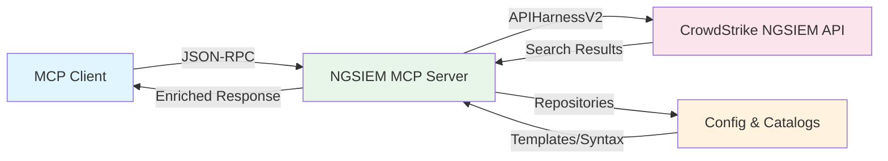
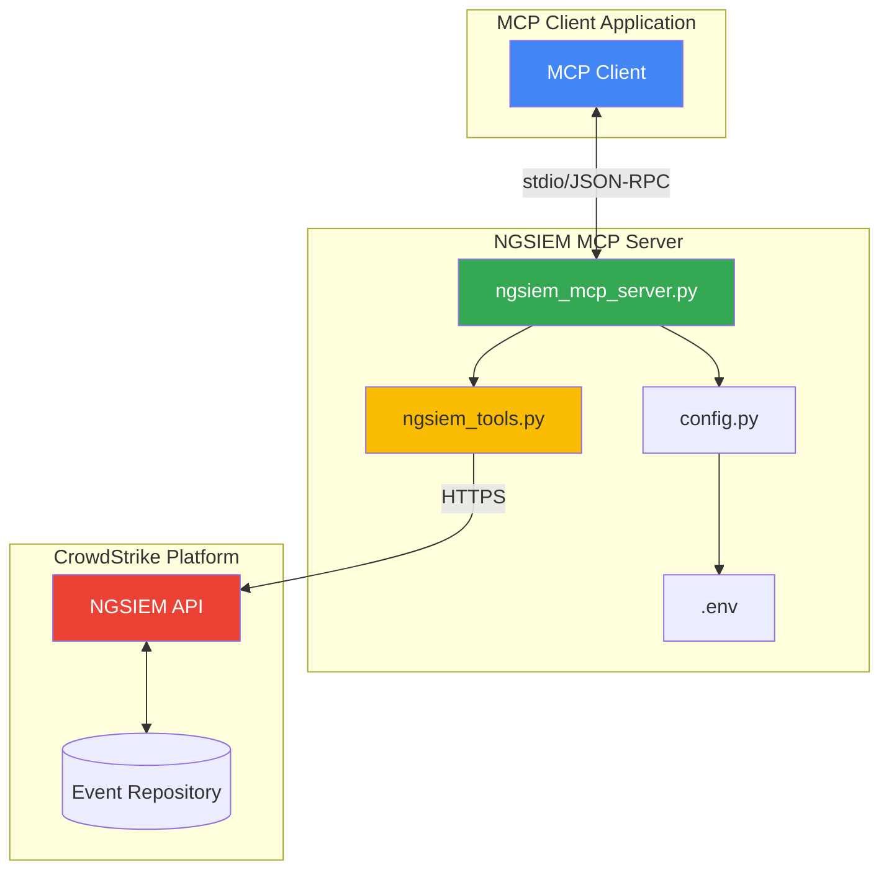
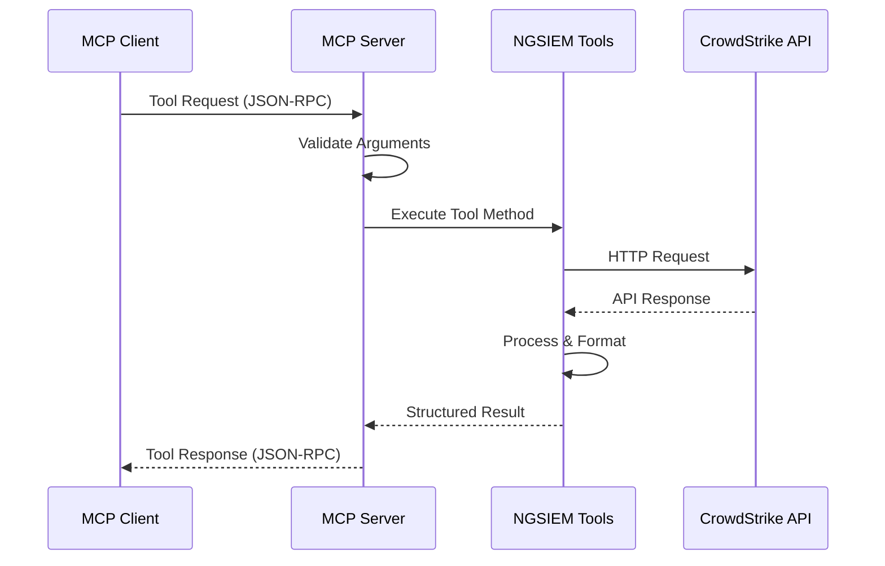
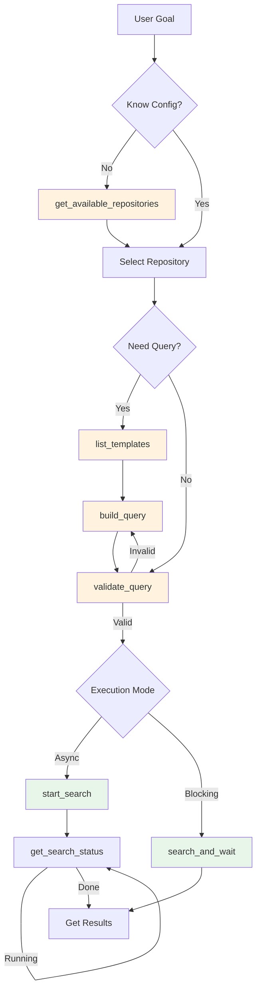
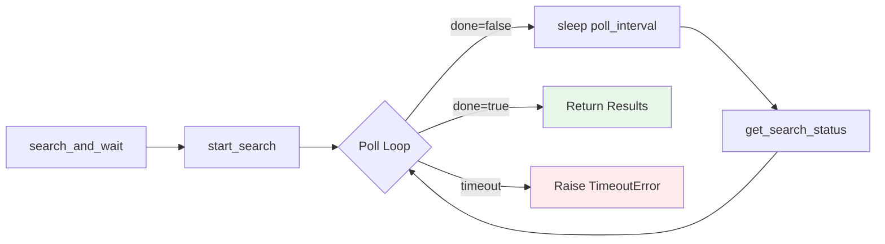
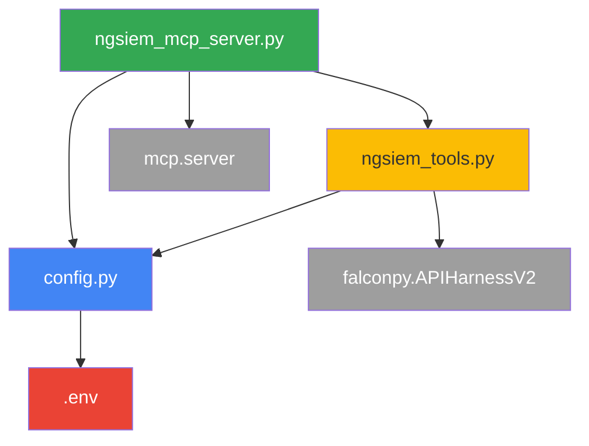
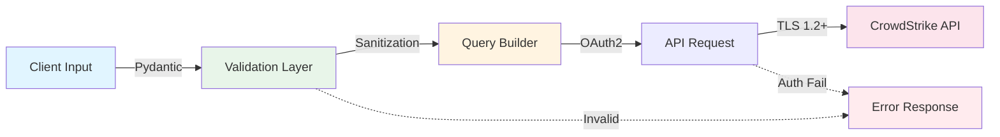
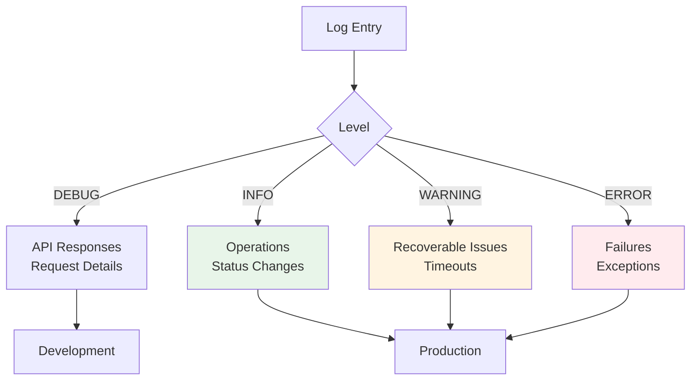

# NGSIEM MCP Server

A Model Context Protocol (MCP) server that provides programmatic access to CrowdStrike NGSIEM search capabilities. This server enables MCP-compatible applications to execute security event searches through a standardized interface.

## Overview

This MCP server exposes CrowdStrike NGSIEM functionality through **ten specialized tools** and **one resource**, allowing any MCP client to perform threat hunting, query building, and security investigations programmatically.



## Quick Start

### Prerequisites

- Python 3.13+
- CrowdStrike API credentials with NGSIEM scope
- MCP-compatible client application

### Installation

1. **Clone and setup environment**:
   ```bash
   cd /path/to/cs-ngsiem-mcp
   python3 -m venv .venv
   source .venv/bin/activate
   pip install -r requirements.txt
   ```

2. **Configure Environment Variables**:
   
   Create a `.env` file in the root directory:
   ```bash
   cp .env.example .env
   ```

   Add your CrowdStrike API credentials (ensure `NGSIEM` and `Falcon Data Replicator` scopes are enabled):
   ```ini
   #.env
   CROWDSTRIKE_CLIENT_ID=your_client_id_here
   CROWDSTRIKE_CLIENT_SECRET=your_client_secret_here
   CROWDSTRIKE_BASE_URL=https://api.eu-1.crowdstrike.com
   NGSIEM_DEFAULT_REPOSITORY=base_sensor
   LOG_LEVEL=INFO
   ```

3. **Configure Repositories**:

   Create the repository catalog file `config/repositories.yaml`:

   ```bash
   cp config/repositories.example.yaml config/repositories.yaml
   ```

   The `repositories.yaml` format allows you to define schema and context for each repository:
   
   ```yaml
   repositories:
     - name: "base_sensor"
       description: "Telemetry events from Falcon sensors (process, network, file)"
       default: true
       data_types:
         - "ProcessRollup2"
         - "NetworkConnectIP4"
       use_cases:
         - "Threat hunting"
         - "Incident investigation"
         
     - name: "audit_logs"
       description: "Falcon platform audit logs"
       default: false
   ```

   > **Tip**: You can use the `get_repo_fieldset` tool to discover available fields in any configured repository.

4. **Configure MCP Client**:

   The server communicates via stdio. Configure your MCP client (e.g., Claude Desktop) to execute:
   
   ```bash
   cd /path/to/cs-ngsiem-mcp && source .venv/bin/activate && python ngsiem_mcp_server.py
   ```

## Architecture

### System Components



### Request Flow




## Available Tools

### Tool Workflow

This diagram illustrates the typical user journey from discovering repositories to executing searches.



### 1. get_available_repositories

Get the list of configured NGSIEM repositories.

**Parameters**: None

**Returns**: List of repositories with descriptions, data types, and use cases.

**Use Case**: Discovery of available data sources before searching.

### 2. start_search

Initiates an asynchronous NGSIEM search.

**Parameters**:
- `repository` (string, optional): Repository name (defaults to `.env` config)
- `query_string` (string, required): NGSIEM query syntax
- `start` (string, optional): Time range (default: "1d")
- `is_live` (boolean, optional): Live search mode (default: false)

**Returns**: Search job ID for status polling

**Use Case**: Long-running searches where client wants progress control

**Example Query**:
```
#event_simpleName=ProcessRollup2 | FileName=powershell.exe
```

### 3. get_search_status

Retrieves status and results of a running search.

**Parameters**:
- `repository` (string, optional): Repository name
- `search_id` (string, required): ID from start_search

**Returns**: Status, event count, and results (if complete)

**Use Case**: Polling for search completion

### 4. search_and_wait

Executes search and waits for completion (blocking operation).

**Parameters**:
- `repository` (string, optional): Repository name
- `query_string` (string, required): NGSIEM query
- `start` (string, optional): Time range (default: "1d")
- `is_live` (boolean, optional): Live search mode (default: false)
- `max_wait_seconds` (integer, optional): Timeout (default: 300, max: 3600)
- `poll_interval` (integer, optional): Poll frequency (default: 2s)

**Returns**: Complete results or timeout error

**Use Case**: Quick searches with immediate results needed

**Internal Flow**:


### 5. stop_search

Cancels a running search.

**Parameters**:
- `repository` (string, optional): Repository name
- `search_id` (string, required): ID to cancel

**Returns**: Cancellation confirmation

**Use Case**: Terminating long-running searches

### 6. get_query_reference

Access NGSIEM query language documentation.

**Parameters**:
- `category` (string, optional): Filter by category (aggregate, filtering, security, etc.)
- `function_name` (string, optional): Get details for specific function
- `search_term` (string, optional): Search functions by keyword

**Returns**: Function documentation with syntax and examples

**Use Case**: Discover available functions before building queries

### 7. list_templates

Browse pre-built security query templates.

**Parameters**:
- `category` (string, optional): Filter by category (threat_hunting, ioc_hunting, etc.)
- `search_term` (string, optional): Search templates by keyword

**Returns**: Available templates with descriptions and MITRE ATT&CK mapping

**Use Case**: Find ready-to-use queries for common security operations

### 8. validate_query

Validate query syntax before execution.

**Parameters**:
- `query` (string, required): NGSIEM query to validate
- `strict` (boolean, optional): Treat warnings as errors

**Returns**: Validation result with issues and suggestions

**Use Case**: Catch syntax errors before running searches

### 9. build_query

Build queries from templates with parameters.

**Parameters**:
- `template` (string, required): Template name to use
- `parameters` (object, optional): Values for template placeholders

**Returns**: Generated query ready for execution

**Use Case**: Create customized queries from templates

### 10. get_repo_fieldset

**MANDATORY FIRST STEP**: Discover all available fields in a NGSIEM repository.

> **Important**: Call this tool BEFORE constructing any search query. Only use field names returned by this tool in your queries.

**Parameters**:

- `repository` (string, optional): Repository name (uses default from config if not specified)
- `timeout_seconds` (integer, optional): Maximum wait time (1-120 seconds, default: 60)

**Returns**: Complete list of valid field names for the repository

**Use Case**: Schema discovery to prevent query failures from invalid field references

**Security**: Repository name is validated against injection attacks (alphanumeric, underscores, hyphens only)

## Available Resources

### ngsiem://repositories

A JSON-formatted resource providing detailed metadata about all configured repositories.

**Content:**
```json
[
  {
    "name": "base_sensor",
    "description": "Main event stream",
    "data_types": ["ProcessRollup2", "DnsRequest"],
    "use_cases": ["General threat hunting", "Process analysis"]
  }
]
```

**Usage**:
- **Claude Desktop**: Automatically reads this on startup to understand the environment.
- **Manual**: Use `read_resource("ngsiem://repositories")` to inspect config.

## Project Structure

```
cs-ngsiem-mcp/
├── ngsiem_mcp_server.py     # MCP server implementation
├── ngsiem_tools.py           # NGSIEM API wrapper
├── ngsiem_query_catalog.py   # Query function/template catalog
├── ngsiem_query_validator.py # Query syntax validator
├── config.py                 # Configuration management
├── config/                   # Query catalogs
│   ├── ngsiem_functions.yaml # 54 NGSIEM functions
│   ├── ngsiem_syntax.yaml    # Query syntax reference
│   └── ngsiem_templates.yaml # 32 security templates
├── .env                      # Credentials (gitignored)
├── .env.example              # Configuration template
├── requirements.txt          # Python dependencies
└── README.md                 # This file
```

### Module Dependencies



## Security Architecture



### Security Features

- **No hardcoded credentials**: All secrets in `.env`
- **Input validation**: Pydantic models with strict typing
- **Query sanitization**: Prevents injection attacks
- **OAuth2 authentication**: Automatic token management
- **Audit logging**: Detailed operation logs
- **Error handling**: No sensitive data in error messages

## Configuration

### Environment Variables

| Variable | Description | Example | Required |
|----------|-------------|---------|----------|
| `CROWDSTRIKE_CLIENT_ID` | API Client ID | `abc123...` | Yes |
| `CROWDSTRIKE_CLIENT_SECRET` | API Secret | `xyz789...` | Yes |
| `CROWDSTRIKE_BASE_URL` | API Endpoint | `https://api.eu-1.crowdstrike.com` | Yes |
| `NGSIEM_DEFAULT_REPOSITORY` | Default Repository | `base_sensor` | Yes |
| `LOG_LEVEL` | Logging Level | `INFO` | No |
| `LOG_FILE` | Log File Path | `ngsiem_mcp.log` | No |

### Regional Endpoints

| Region | Base URL |
|--------|----------|
| US-1 | `https://api.crowdstrike.com` |
| US-2 | `https://api.us-2.crowdstrike.com` |
| EU-1 | `https://api.eu-1.crowdstrike.com` |

### Default Repository

The `repository` parameter is **optional** in all tools. When omitted, the server uses `NGSIEM_DEFAULT_REPOSITORY` from `.env`.

**Benefits**:
- Fewer parameters required
- Reduced client complexity
- Consistent repository usage

**Override**: Specify `repository` parameter to use a different repository for specific searches.

### Repository Configuration

Define available repositories in `config/repositories.yaml`.

```yaml
repositories:
  - name: base_sensor
    default: true
    description: "Main event stream"
  - name: zscaler
    description: "Zscaler Web logs"
```

**Note**: `config/repositories.yaml` is in `.gitignore` to prevent leaking sensitive internal names.

## Logging

### Log Levels



### Log Location

- **Default**: `ngsiem_mcp.log` (current directory)
- **Custom**: Set `LOG_FILE` in `.env`

### Debug Mode

```bash
# In .env
LOG_LEVEL=DEBUG
```

View logs:
```bash
tail -f ngsiem_mcp.log
```

## Testing

### Manual Testing

```bash
# Test configuration loading
python -c "from config import load_config; print(load_config())"

# Test search initiation
python test_api.py

# Test result retrieval (use ID from previous test)
python check_search.py <search_id>
```

### Example Queries

| Use Case | NGSIEM Query |
|----------|--------------|
| User logon events | `#event_simpleName=*Logon* UserName=USERNAME` |
| Process executions | `#event_simpleName=ProcessRollup2 FileName=PROCESS` |
| Network connections | `#event_simpleName=NetworkConnectIP4 RemoteIP=IP_ADDRESS` |
| DNS queries | `#event_simpleName=DnsRequest DomainName=DOMAIN` |

## Troubleshooting

### Server Won't Start

**Symptom**: MCP client shows "Server disconnected"

**Diagnosis**:
```bash
# Check server logs
tail -50 ~/.local/state/mcp/logs/mcp-server-ngsiem.log
# Or platform-specific log location
```

**Common Causes**:
1. **Missing dependencies**: `pip install -r requirements.txt`
2. **Import errors**: Verify all imports in server code
3. **Invalid credentials**: Check `.env` file

### Authentication Failed

**Symptom**: "401 Unauthorized" or "Authentication failed"

**Solution**:
1. Verify credentials in CrowdStrike Console
2. Ensure API key has NGSIEM scope
3. Check `CROWDSTRIKE_BASE_URL` matches your region

### Repository Not Found

**Symptom**: "404 Not Found" or empty response

**Solution**:
1. Verify repository name in NGSIEM console (case-sensitive)
2. Update `NGSIEM_DEFAULT_REPOSITORY` in `.env`
3. Ensure API key has access to repository

### Empty Search Results

**Symptom**: Status 200 but empty body `{}`

**Causes**:
- Incorrect repository name
- Invalid query syntax
- No events match query criteria

**Solution**:
1. Test with simple query: `#event_simpleName=*`
2. Verify repository access
3. Check time range (`start` parameter)

## Development

### Key Design Decisions

1. **APIHarnessV2 over NGSIEM class**: Better compatibility with EU regions
2. **Async architecture**: Non-blocking MCP handlers
3. **Optional repository**: Reduces client complexity
4. **Immediate search ID return**: Enables async polling patterns

### Adding New Tools

1. Define Pydantic model in `ngsiem_mcp_server.py`
2. Implement method in `ngsiem_tools.py`
3. Add tool definition to `@app.list_tools()`
4. Add handler to `@app.call_tool()`

### Future Enhancements

- [ ] Async API calls with `asyncio.to_thread()`
- [ ] Result caching
- [ ] Lookup file management
- [x] Query builder assistant
- [ ] Rate limiting
- [ ] Exponential backoff retry logic

## Resources

- [Model Context Protocol](https://modelcontextprotocol.io/)
- [CrowdStrike NGSIEM API Documentation](https://falcon.crowdstrike.com/documentation/page/ngsiem-api)
- [FalconPy SDK](https://github.com/CrowdStrike/falconpy)
- [NGSIEM Query Language Guide](https://falcon.crowdstrike.com/documentation/page/ngsiem-query-language)


## Contributing

For issues or enhancements:
1. Test changes locally
2. Update documentation
3. Follow existing code style
4. Ensure security best practices

---

**Built with**: Python 3.13 | MCP SDK 1.25.0 | FalconPy 1.5.5 | Pydantic 2.12.5
