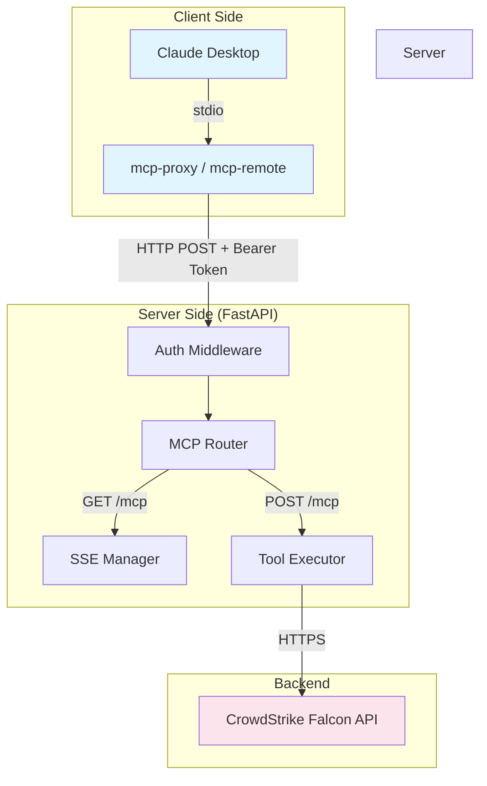
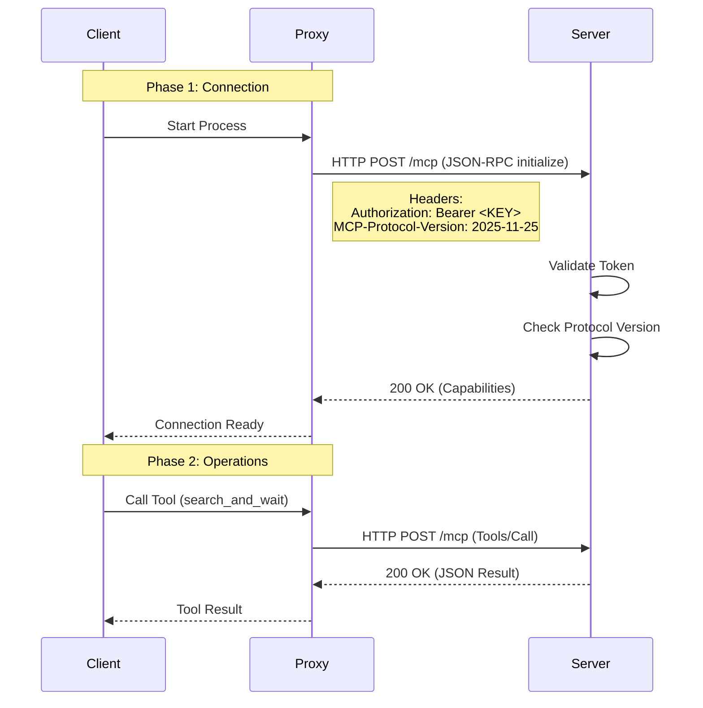
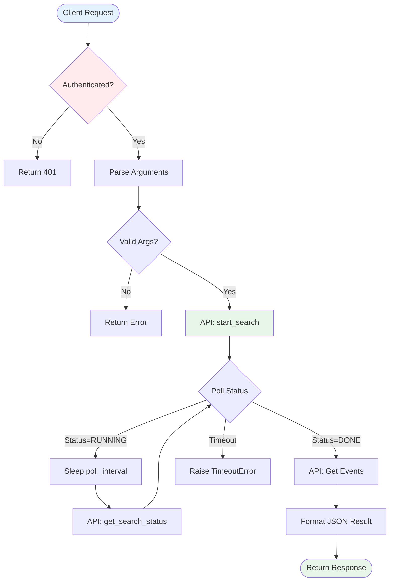
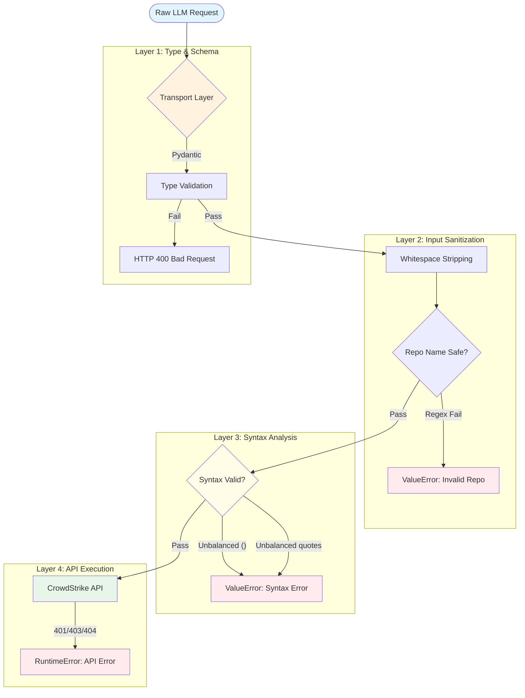

# NGSIEM MCP Server Architecture & Feature Guide

This document details the architecture, request flows, and new features of the NGSIEM MCP HTTP Server.

## 1. HTTP Server Architecture

The server implements the **MCP 2025-11-25 Streamable HTTP** transport specification using **FastAPI** and **Uvicorn**. It is designed for production environments where the MCP client runs remotely from the server.

### System Overview



### Key Features

1.  **Dual Transport Mode**:
    - **Stdio**: Legacy mode for local, single-process usage.
    - **HTTP Streamable**: New production mode supporting remote connections and high concurrency.

2.  **Security**:
    - **Bearer Authentication**: All requests require a `Authorization: Bearer <MCP_API_KEY>` header.
    - **Protocol Versioning**: strict validation of `MCP-Protocol-Version` headers (defaults to 2025-11-25).
    - **Input Sanitization**: Pydantic models validate all JSON-RPC payloads.

3.  **Concurrency**:
    - Fully async implementation using `asyncio`.
    - Non-blocking tool execution.
    - SSE (Server-Sent Events) capability for long-running operations (optional).

## 2. Request Processing Flow

The server handles requests via a unified `/mcp` endpoint that supports both SSE (GET) and JSON-RPC (POST).

### Connection & Authentication



## 3. Tool Execution Logic

### Search Workflow (`search_and_wait`)

This is the most complex tool which handles the async nature of NGSIEM searches automatically.



## 4. Configuration & Deployment

### Server Scripts

We provide dedicated scripts to manage the server lifecycle:

| Script | Purpose | Description |
|--------|---------|-------------|
| `start_http_server.sh` | **Production Server** | Starts Uvicorn with logging, env loading, and graceful shutdown. |
| `start_http_inspector.sh` | **Development/Test** | Launches MCP Inspector to test the running HTTP server. |

### Logging Configuration

The server maintains two separate log streams for easier debugging:

1.  **Access Logs** (`ngsiem-mcp-http.log`):
    - Records all incoming HTTP requests.
    - Status codes, paths, and timing.
    - Produced by Uvicorn.

2.  **Application Logs** (`ngsiem-mcp-app.log`):
    - Internal server logic.
    - Tool execution details.
    - API interaction errors.
    - Produced by the Python application (`logging`).

### Client Configuration (Claude Desktop)

To connect Claude Desktop to this HTTP server, use the `mcp-remote` proxy to handle authentication:

```json
{
  "mcpServers": {
    "ngsiem-http": {
      "command": "npx",
      "args": [
        "-y",
        "mcp-remote",
        "http://localhost:8080/mcp",
        "--header",
        "Authorization: Bearer <YOUR_MCP_API_KEY>"
      ]
    }
  }
}
```

## 5. Query Validation Pipeline

The server implements a multi-layered defense-in-depth strategy to ensure query integrity and security before any request reaches the CrowdStrike API.



### Validation Layers

#### 1. Transport Layer (Pydantic)

*   **Mechanism**: FastAPI Pydantic models.
*   **Checks**: Ensures `repository` is a string, `timeout` is an integer, and all required fields are present.
*   **Outcome**: Rejects malformed JSON payloads immediately.

#### 2. Input Sanitization

*   **Mechanism**: `NGSIEMSearchTools.start_search`
*   **Checks**:
    *   Trims leading/trailing whitespace.
    *   **Repo Name Strictness**: Enforces `^[a-zA-Z0-9_-]+$` regex to prevent command injection via repository parameters.

#### 3. Query Syntax Validator

*   **Mechanism**: `NGSIEMSearchTools.validate_query_syntax()`
*   **Checks**:
    *   **Balanced Parentheses**: Verifies that every `(`, `[`, `{` has a corresponding closing tag.
    *   **Balanced Quotes**: Checks for even number of double quotes `"` to prevent malformed string literals.
*   **Why**: Catches "hallucinated" syntax errors from LLMs before waiting for expensive API calls.

#### 4. Pre-Query Schema Discovery (Policy)

*   **Mechanism**: `get_repo_fieldset` Tool
*   **Policy**: The System Prompt instructs the LLM to call `get_repo_fieldset` *before* searching.
*   **Validation**: This tool returns the **authoritative** list of fields for a repository, preventing the LLM from guessing (hallucinating) field names that don't exist in the specific log source.
